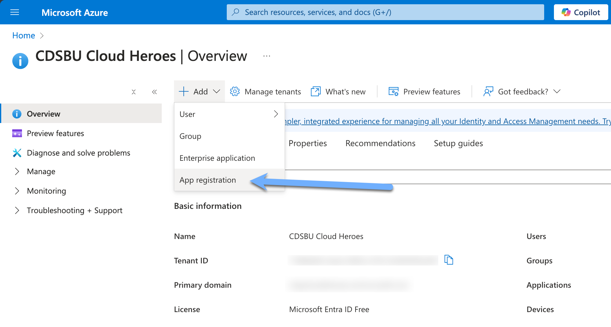

# Prerequisites

### Software Requirements

The software is footprint agnostic, running both in on-prem and in the cloud, connecting to NetApp and non-NetApp storage appliances.

- A container Runtime:
    - Deployable on Docker/Podman with a Compose file
    - Deployable on Kubernetes cluster with a Helm Chart
- A database server:
    - Either Postgres or MySQL
    - An optional Postgres configuration is provided for testing purposes only
- A Microsoft M365 Copilot License is required if connecting to MS Graph

> [!IMPORTANT]  
> AWS ECS (Fargate) is NOT supported. This is due to the containers being unable to mount shares to the container(s) - a critical requirement of NetApp Neo.

### Network Requirements

- **Port 8080** open for internal management of the connector
- **Port 445** open for SMB file share access
- SMB File Share(s) must be routable to the connector
- **Port 443** open for outbound traffic when connecting to M365 Copilot Graph API

## M365 Copilot Use Case

The Neo Connector has to be registered as an Application within your M365 tenant. 

### Register the connector in Azure Entra

In order for the connector to be able to securely communicate with M365 Copilot.

1. Navigate to the Azure Entra portal and select "Add" and select the "App Registration" option.
2. Fill in the required fields and click "Register". (No Redirect URI is required)
3. Copy the Application (client) ID and Directory (tenant) ID from the Overview page.
4. Navigate to the "API permissions" page and select "Add a permission".
5. Select "Microsoft Graph" and then "Application permissions".
6. Search for "ExternalConnection.ReadWrite.OwnedBy" and select the checkbox.
7. Search for "ExternalItem.ReadWrite.OwnedBy" and select the checkbox.
8. Search for "User.Read" and select the checkbox.
9. Search for "User.Read.All" and select the checkbox.
10. Search for "Group.Read.All" and select the checkbox
11. Click "Add permissions".
12. Click "Graph admin consent for (tenant)" and click "Yes".
13. Navigate to the "Certificates & secrets" page and click "New client secret".
14. Fill in the required fields and click "Add".
15. Copy the value of the client secret.

You have successfully registered the connector in Azure ENTRA. You will need the Application ID, Directory ID, and Client Secret for the next steps. 
